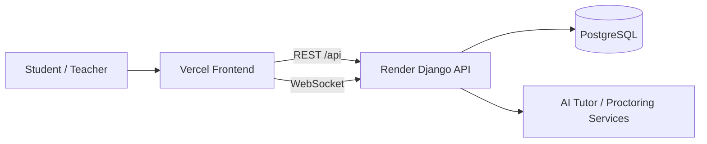

# ProctorX AI Pro

> A polished, full-stack online exam and AI proctoring platform built with Django on the backend and TanStack Start + Vite on the frontend.

## At a glance

- **Backend:** Django, Django REST Framework, Channels, PostgreSQL
- **Frontend:** TanStack Start, React, Vite, TypeScript
- **AI services:** tutoring, grading, planning, and voice utilities in `ai_tutor/`
- **Deployment:** Render for the API, Vercel for the frontend

The frontend talks to the backend through the API base URL defined in `frontend/src/lib/api.ts`:

- `VITE_API_BASE_URL` → REST API calls such as login, refresh token, exams, questions
- `VITE_WS_BASE_URL` → WebSocket connections for live/proctoring features

## Live links

- **Frontend (Vercel):** `https://proctorx-ai-web.vercel.app`
- **Backend API (Render):** `https://proctorx-ai-api.onrender.com`
- **Backend Admin:** `https://proctorx-ai-api.onrender.com/admin/login/`

> If you later switch to a custom domain, update these links and the env vars (`VITE_API_BASE_URL`, `VITE_WS_BASE_URL`, `CORS_ALLOWED_ORIGINS`, `CSRF_TRUSTED_ORIGINS`) together.

## Role-based feature matrix

| Role | Core capabilities | Advanced / AI capabilities |
|---|---|---|
| **Admin** | Manage users, roles, system configuration, global monitoring, access admin panel | Review proctoring logs and platform-wide performance signals |
| **Teacher** | Create exams, manage questions/choices, publish exams, monitor student attempts, view results | Use AI-assisted grading/tutoring services and proctor insights for academic integrity |
| **Student** | Register/login, enroll in exams, attempt questions, submit answers, see results/progress | Receive AI tutor support and participate in monitored/proctored exam sessions |

### Experience by role (quick flow)

- **Admin journey:** platform setup → governance → oversight
- **Teacher journey:** exam design → publish → monitor → evaluate
- **Student journey:** join exam → attempt → submit → review performance

## Architecture



### How the frontend and backend connect

1. The browser loads the app from **Vercel**.
2. The frontend reads `VITE_API_BASE_URL` and sends REST requests to the **Render** backend.
3. Auth flows use Django endpoints like `/api/auth/login/`, `/api/auth/token/refresh/`, and `/api/auth/logout/`.
4. Live proctoring features use the `VITE_WS_BASE_URL` WebSocket endpoint.
5. Render stores persistent data in PostgreSQL and serves the Django admin, API, and Channels ASGI app.

## Project layout

- `frontend/` — client app, SSR server, and Vercel config
- `proctor_ai/` — Django project settings, ASGI, WSGI, routing
- `users/`, `exams/`, `proctoring/`, `results/`, `core/`, `api/` — Django apps and API endpoints
- `ai_tutor/` — AI routing, grading, planner, and voice helpers
- `render.yaml` — Render blueprint
- `docs/deployment-render-vercel.md` — deployment notes

## Features

- Register, login, and token refresh flow
- Exam creation and enrollment
- Question bank, choices, results, and grading
- Proctoring logs and AI-assisted monitoring
- SSR-friendly frontend with a clean production build

## Proctoring system (detailed)

The `proctoring/` module is designed to help maintain exam integrity in real-time and post-exam review.

### What the system monitors

- **Session behavior events:** suspicious activity signals during an active exam session
- **Exam context metadata:** user, exam, and timestamp-linked monitoring records
- **WebSocket-ready live flow:** near real-time event delivery path for active proctoring dashboards
- **Reviewable history:** event logs that can be audited later by teachers/admins

### Typical proctoring flow

1. Student starts an exam session.
2. Frontend captures exam-session proctoring signals/events.
3. Backend stores structured proctoring records (`proctoring` app models/endpoints).
4. Teachers/Admins review logs and flags to detect integrity risks.
5. Final result evaluation can include proctoring evidence.

### Why this matters

- Reduces unfair exam behavior risk
- Gives instructors evidence-backed review tools
- Improves trust in online assessments at scale

> Note: exact trigger sensitivity, policy thresholds, and escalation rules should be aligned with your institution's academic integrity policy.

## Local setup

### Prerequisites

- Python 3.10+
- Node 18+
- npm
- A virtual environment is recommended

### Backend

```bash
python -m venv .proctorai_env
```

```bash
.\.proctorai_env\Scripts\activate
```

```bash
pip install -r requirements.txt
python manage.py migrate
python manage.py runserver
```

### Frontend

```bash
cd frontend
npm ci
npm run dev
```

## Environment variables

### Backend

- `DJANGO_SECRET_KEY`
- `DJANGO_DEBUG`
- `DJANGO_ALLOWED_HOSTS`
- `DATABASE_URL`
- `CORS_ALLOWED_ORIGINS`
- `CSRF_TRUSTED_ORIGINS`
- `FRONTEND_URL`
- `EMAIL_HOST_USER`
- `EMAIL_HOST_PASSWORD`
- `GEMINI_API_KEY` / `OPENAI_API_KEY` / `GROQ_API_KEY` if enabled

### Frontend

- `VITE_API_BASE_URL` — example: `https://proctorx-ai-api.onrender.com/api`
- `VITE_WS_BASE_URL` — example: `wss://proctorx-ai-api.onrender.com`

These frontend variables are read at build time from `import.meta.env`, so set them in Vercel project settings before deployment.

## Deployment flow

### Render backend

The Render blueprint is defined in `render.yaml`.

It uses:

- **Build command:** `bash ./scripts/build.sh`
- **Start command:** `daphne -b 0.0.0.0 -p $PORT proctor_ai.asgi:application`
- **Auto deploy:** enabled

The build step runs:

1. Python dependency install
2. Django migrations
3. Static file collection
4. `python manage.py bootstrap_data`

That bootstrap step keeps deploys friendly by:

- merging users and groups from the cleaned fixture when available
- seeding exam data if the database is empty
- resetting Postgres sequences so inserts do not collide with existing IDs

### Vercel frontend

The frontend build is configured in `frontend/vercel.json` and expects the backend API to be reachable on Render.

Recommended Vercel settings:

- **Root directory:** `frontend`
- **Install command:** `npm ci`
- **Build command:** `npm run build`
- **Environment variables:** `VITE_API_BASE_URL`, `VITE_WS_BASE_URL`

## Production checklist

Before calling the app live, verify:

- Render deploy completed successfully
- Django admin opens on the Render backend
- Frontend loads on Vercel
- Login requests hit Render and return tokens
- Exam data appears in the frontend
- WebSocket/proctoring connection opens without CORS issues

## Troubleshooting

### Frontend loads, but data does not appear

- Check `VITE_API_BASE_URL` in Vercel
- Confirm the Render database has exams/questions
- Verify the backend response in browser devtools network tab

### API or auth returns 404/405

- Make sure the frontend is calling `/api/...`
- Confirm the backend deployment is healthy and migrations finished

### Deploy succeeds, but old IDs cause duplicate key errors

- Run `python manage.py bootstrap_data` once on the target database
- This resets sequences after imports and prevents PK collisions

### WebSockets fail in production

- Use `wss://` for the frontend websocket URL
- Confirm Render is using the ASGI start command with `daphne`

## Useful docs

- `docs/api.md`
- `docs/deployment-render-vercel.md`
- `render.yaml`
- `frontend/vercel.json`
- `frontend/src/lib/api.ts`

## License

MIT License — see `LICENSE`.
