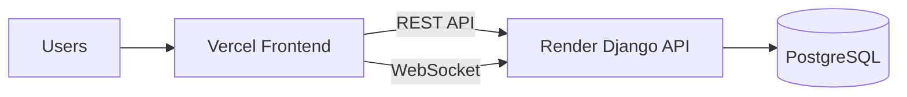

# Deployment guide: Render backend + Vercel frontend

This project is split into two deployable parts:

- **Backend**: Django / DRF / Channels on **Render**
- **Frontend**: TanStack Start / Vite on **Vercel**

The repo now includes:

- `render.yaml` — Render blueprint for the backend
- `frontend/vercel.json` — Vercel routing/build config for the frontend

## Architecture

### What lives where

- **Render** runs the Django app, API, auth, admin, and WebSocket server.
- **Vercel** serves the browser app and sends API/WebSocket traffic to Render.

## 1) Deploy the backend on Render

### Option A: use the blueprint

1. Push this repo to GitHub.
2. In Render, create a **New Blueprint** from the repository root.
3. Render will read `render.yaml` automatically.
4. Confirm the following are created:
   - a **web service** named `proctorx-ai-api`
   - a **PostgreSQL database** named `proctorx-ai-db`

### Important backend env vars

Most of these are already defined in `render.yaml`, but review them before going live:

- `DJANGO_SECRET_KEY` — auto-generated by Render
- `DJANGO_DEBUG=false`
- `DJANGO_ALLOWED_HOSTS=proctorx-ai-api.onrender.com`
- `DATABASE_URL` — injected from the Render PostgreSQL database
- `CORS_ALLOWED_ORIGINS=https://proctorx-ai-web.vercel.app`
- `CSRF_TRUSTED_ORIGINS=https://proctorx-ai-web.vercel.app`
- `FRONTEND_URL=https://proctorx-ai-web.vercel.app`

If you use email or AI features in production, also set:

- `EMAIL_HOST_USER`
- `EMAIL_HOST_PASSWORD`
- `GEMINI_API_KEY` / `OPENAI_API_KEY` / `GROQ_API_KEY`

### Render runtime details

- **Build command**: runs `scripts/build.sh` (installs deps, migrates, collects static files)
- **Start command**: launches `daphne` against `proctor_ai.asgi:application`

That start command is important because this app uses Channels/WebSockets.

### After the first deploy

1. Open the service logs and confirm the build script completed.
2. Visit `https://proctorx-ai-api.onrender.com/admin/login/`.
3. Create/load your admin account if needed.
4. Verify the API is reachable from your browser and that WebSocket connections are accepted.

### Media note

The project currently stores uploaded media under `media/` locally. That is fine for development, but if you need persistent uploads in production, add a **persistent disk** on Render and point `MEDIA_ROOT` there.

## 2) Deploy the frontend on Vercel

### Recommended setup

1. Create a new Vercel project.
2. Set the **Root Directory** to `frontend`.
3. Use **npm** as the package manager. The frontend also has a `package-lock.json`, and the local build in this workspace was verified with `npm run build`.
4. Vercel will use `frontend/vercel.json` for routing and build behavior.

### Frontend build-time env vars

Set these in the Vercel project settings:

- `VITE_API_BASE_URL=https://proctorx-ai-api.onrender.com/api`
- `VITE_WS_BASE_URL=wss://proctorx-ai-api.onrender.com`

These must be available at build time because the frontend reads them from `import.meta.env`.

### Why the Vercel config exists

TanStack Start builds both client and server artifacts. The custom Vercel config forwards all browser requests to a small serverless wrapper so the app can render correctly instead of behaving like a half-finished static site. Nobody wants a deployment that looks confident but falls over at the door.

## 3) Files you should keep in sync

- `proctor_ai/settings.py`
  - production static file handling
  - CORS and CSRF origin lists
- `render.yaml`
  - Render blueprint
- `frontend/vercel.json`
  - Vercel rewrites and build settings
- `frontend/api/index.ts`
  - SSR/serverless wrapper that forwards browser requests to the built TanStack Start server
- Vercel project env vars
  - `VITE_API_BASE_URL`
  - `VITE_WS_BASE_URL`

## 4) Suggested production checklist

Before announcing the app is live, verify:

- backend service responds on Render
- admin page loads
- migrations ran successfully
- frontend loads on Vercel
- login/register works against the Render API
- WebSocket proctoring connection opens successfully
- CORS and CSRF errors are not present in the browser console

## 5) Common failure points

### "collectstatic" fails on Render

Make sure `STATIC_ROOT` is defined. The backend settings now set it to `BASE_DIR / 'staticfiles'`.

### Frontend loads but API calls fail

Check that Vercel has the correct build-time env vars and that `CORS_ALLOWED_ORIGINS` / `CSRF_TRUSTED_ORIGINS` include the Vercel domain.

### WebSockets fail in production

Confirm the frontend uses `wss://` and that Render is running the ASGI app with `daphne`.

## 6) Local sanity check before deploying

From the repo root:

1. Run Django checks/migrations locally.
2. Build the frontend locally.
3. Confirm the browser app talks to the API using the production-style env variables.

If you want, you can deploy Render first, then point Vercel at the live backend.